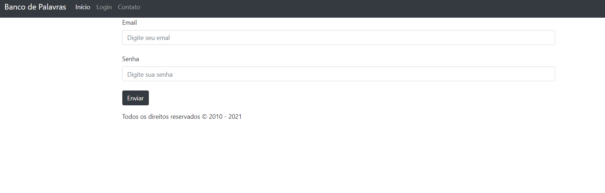
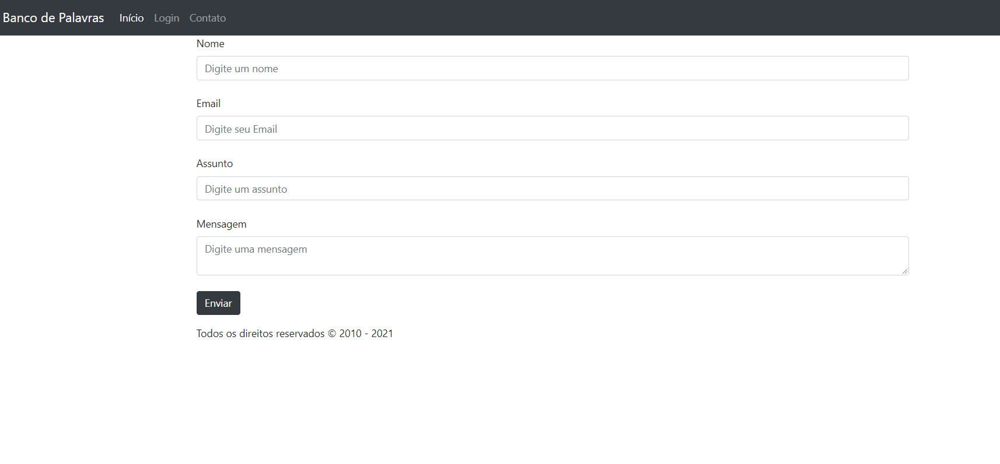
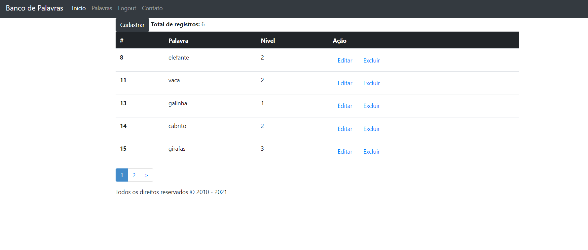
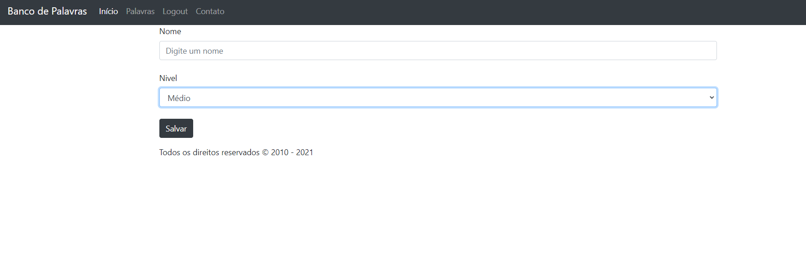

# ASPNET Core MVC - Básico.

projeto básico  desenvolver um sistema web, um site dinâmico, onde seu conteúdo pode sofrer alterações devido a utilização de banco de dados, algoritmos enfim de programação. 
Usando o ASP.NET Core 2.1 MVC e trabalhar com funcionalidades de validação(DataAnnotations), Layouts, Banco de dados, Sessão, Filtros.


## 🖼 Screenshot das telas da aplicação <br/>
<p>Tela Principal</p>
<br/>
<br/>
<p>Tela de Login</p>
<br/>
<br/>
<p>Tela De Envio De Email</p>
<br/>
<br/>
<p>Tela Da tabela</p>
<br/>
<br/>
<p>Tela cadastro de itens e alteração</p>
<br/>
<br/>


<br/>
## 🚀 Tecnologias utilizadas <br/>
<br/>


- C#  asp net<br/>
- sqlServer <br/>
- html e css <br/>
- Razor <br/>
<br/>

## 🚀 Como usar <br/>

```bash
# na classe site01/sistema-de-banco-de-palavras/Library/Mail/Constants.cs para que seja enviado e necessário que altera o email e a senha aonde voce deseja que seja encaminhado.
nos campos:  public readonly static string Usuario = "email seu";
               public readonly static string Senha = "senha sua ";

# na classe startup site01/sistema-de-banco-de-palavras/Startup.cs 
# e necessario caso deseja que seu banco de dados seja integrado, alterar este seguinte codigo, passando o provider do seu banco de dados: options.UseSqlServer("Password=123456;Persist Security Info=True;User ID=sa;Initial Catalog=Site01;Data Source=DESKTOP-PCE1A1P\\SQLEXPRESS;");

# Entrar numa IDE de sua preferência 


```


## Linkedin abaixo

<h4 align="center">
   Feito com Por   <a href="https://www.linkedin.com/in/luiz-carlos-b50693173/" target="_blank"> Luiz Carlos </a>
</h4>

</html>
